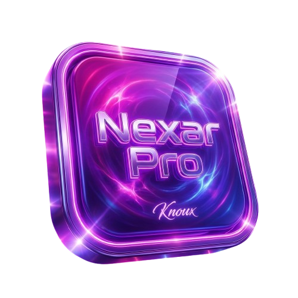

<div align="center">
  
  
  # 🚀 Nexar Pro v3.0 — Ultimate Edition
  ### by **Knoux**
  
  *النسخة الشاملة المدمجة من جميع الإصدارات*
  
  []()
  []()
  []()
</div>

---

## 📋 ما الجديد في v3.0 Ultimate Edition

هذه النسخة هي **دمج شامل** لجميع الإصدارات السابقة:
- ✅ `nexar-pro` — الإصدار الأساسي مع Retouch Engine
- ✅ `nexar-pro-complete` — النسخة الكاملة مع جميع الشاشات
- ✅ `knoux-nexar-pro-REBUILT-v3` — أحدث إعادة بناء مع 25+ شاشة
- ✅ `nexar-pro-enhanced-v2` — الخدمات المحسّنة (AI, Streaming, Security, Camera)
- ✅ جميع الملفات الـ FIXED/ADVANCED المرفوعة

---

## 🏗️ هيكل المشروع

```
nexar-pro-ULTIMATE/
├── 📱 app/
│   ├── (tabs)/
│   │   ├── index.tsx                    # الرئيسية
│   │   ├── nexar-dashboard.tsx          # لوحة NEXAR PRO
│   │   ├── nexar-retouch.tsx            # استوديو الريتاش
│   │   ├── screen-recording.tsx         # تسجيل الشاشة
│   │   ├── pro-services.tsx             # الخدمات الاحترافية
│   │   ├── settings.tsx                 # الإعدادات
│   │   │
│   │   ├── retouch-engine/              # محرك الريتاش الكامل
│   │   │   ├── layers/                  # إدارة الطبقات
│   │   │   ├── masks/                   # نظام الأقنعة
│   │   │   ├── adjustments/             # التعديلات
│   │   │   ├── batch/                   # المعالجة الجماعية
│   │   │   ├── presets/                 # الإعدادات المسبقة
│   │   │   └── import/                  # الاستيراد
│   │   │
│   │   ├── audio-recording.tsx          # تسجيل الصوت
│   │   ├── audio-studio.tsx             # استوديو الصوت
│   │   ├── video-editing.tsx            # تحرير الفيديو
│   │   ├── editor-studio.tsx            # استوديو التحرير
│   │   ├── cloud-sync.tsx               # المزامنة السحابية
│   │   ├── ai-features.tsx              # مميزات الذكاء الاصطناعي
│   │   ├── ai-studio.tsx                # استوديو الذكاء الاصطناعي
│   │   ├── face-retouching.tsx          # تنعيم الوجه
│   │   ├── effects.tsx                  # التأثيرات
│   │   ├── streaming.tsx                # البث المباشر
│   │   ├── multi-camera.tsx             # كاميرات متعددة
│   │   ├── multicam-studio.tsx          # استوديو متعدد الكاميرات
│   │   ├── advanced-recording.tsx       # التسجيل المتقدم
│   │   ├── beauty-makeup.tsx            # الجمال والمكياج
│   │   ├── gesture-control.tsx          # التحكم بالإيماءات
│   │   ├── live-chat.tsx                # الدردشة المباشرة
│   │   ├── chat.tsx                     # المحادثات
│   │   ├── analytics.tsx                # الإحصائيات
│   │   ├── subscriptions.tsx            # الاشتراكات
│   │   ├── payment.tsx                  # المدفوعات
│   │   ├── license-keys.tsx             # مفاتيح الترخيص
│   │   ├── referrals.tsx                # الإحالات
│   │   ├── ratings-reviews.tsx          # التقييمات
│   │   ├── notifications-advanced.tsx   # الإشعارات المتقدمة
│   │   ├── admin-dashboard.tsx          # لوحة الإدارة
│   │   ├── developer.tsx                # أدوات المطور
│   │   └── customer-support.tsx         # دعم العملاء
│   │
│   ├── splash.tsx                       # شاشة السبلاش
│   ├── welcome.tsx                      # الترحيب
│   ├── onboarding.tsx                   # التهيئة
│   ├── hero-launch.tsx                  # الإطلاق
│   ├── profile.tsx                      # الملف الشخصي
│   ├── premium.tsx                      # المميزات المتميزة
│   ├── about.tsx                        # حول التطبيق
│   ├── search.tsx                       # البحث
│   ├── notifications.tsx                # الإشعارات
│   ├── notifications-screen.tsx         # شاشة الإشعارات
│   └── _layout.tsx                      # التخطيط الرئيسي
│
├── 🔧 lib/
│   ├── nexar/
│   │   ├── ServiceRegistry.ts           # سجل الخدمات
│   │   ├── ServiceRegistry-COMPLETE.ts  # السجل الكامل
│   │   ├── AdvancedServices.ts          # الخدمات المتقدمة
│   │   ├── AdvancedServices-COMPLETE.ts # الخدمات الكاملة
│   │   ├── RetouchEngine.ts             # محرك الريتاش
│   │   └── RetouchEngine-COMPLETE.ts    # المحرك الكامل
│   │
│   └── services/
│       ├── ai-service.ts                # خدمة الذكاء الاصطناعي
│       ├── ai-service-ADVANCED.ts       # الذكاء المتقدم
│       ├── ai-service-enhanced.ts       # الذكاء المحسّن
│       ├── firebase-service.ts          # Firebase
│       ├── firebase-service-FIXED.ts    # Firebase المُصلح
│       ├── streaming-service.ts         # البث
│       ├── streaming-service-enhanced.ts# البث المحسّن
│       ├── video-editing-service.ts     # تحرير الفيديو
│       ├── video-editing-service-FIXED.ts # التحرير المُصلح
│       ├── screen-recording-service.ts  # تسجيل الشاشة
│       ├── screen-recording-service-FIXED.ts # التسجيل المُصلح
│       ├── subscription-service.ts      # الاشتراكات
│       ├── subscription-service-COMPLETE.ts # الاشتراكات الكاملة
│       ├── security-service.ts          # الأمان
│       ├── camera-service.ts            # الكاميرا
│       ├── cloud-storage-service.ts     # التخزين السحابي
│       ├── video-editor-service-enhanced.ts # المحرر المحسّن
│       ├── analytics-service.ts         # التحليلات
│       ├── payment-service.ts           # المدفوعات
│       ├── notification-service.ts      # الإشعارات
│       ├── advanced-notifications-service.ts # إشعارات متقدمة
│       ├── face-retouching-service.ts   # تنعيم الوجه
│       ├── advanced-face-retouching-service.ts # تنعيم متقدم
│       ├── body-retouching-service.ts   # تنعيم الجسم
│       ├── makeup-service.ts            # المكياج
│       ├── effects-service.ts           # التأثيرات
│       ├── multi-camera-service.ts      # الكاميرات المتعددة
│       ├── audio-recording-service.ts   # تسجيل الصوت
│       ├── cloud-sync-service.ts        # المزامنة السحابية
│       ├── gesture-control-service.ts   # التحكم بالإيماءات
│       ├── live-chat-service.ts         # الدردشة المباشرة
│       ├── lottie-service.ts            # الرسوم المتحركة
│       ├── referral-service.ts          # الإحالات
│       ├── ratings-reviews-service.ts   # التقييمات
│       ├── admin-dashboard-service.ts   # لوحة الإدارة
│       ├── local-database-service.ts    # قاعدة البيانات المحلية
│       ├── database-service.ts          # قاعدة البيانات
│       └── performance-monitor-service.ts # مراقبة الأداء
│
├── 🗄️ server/
│   ├── _core/
│   │   ├── index.ts                     # نقطة الدخول
│   │   ├── trpc.ts                      # tRPC إعداد
│   │   ├── context.ts                   # السياق
│   │   ├── oauth.ts                     # OAuth
│   │   ├── llm.ts                       # نماذج اللغة
│   │   ├── imageGeneration.ts           # توليد الصور
│   │   ├── voiceTranscription.ts        # تحويل الصوت
│   │   ├── notification.ts              # الإشعارات
│   │   └── systemRouter.ts              # التوجيه
│   ├── routers.ts                       # الموجهات
│   ├── db.ts                            # قاعدة البيانات
│   └── storage.ts                       # التخزين
│
├── 💾 drizzle/
│   ├── schema.ts                        # مخطط البيانات
│   ├── relations.ts                     # العلاقات
│   └── migrations/                      # ترحيلات البيانات
│
├── 🌍 lib/i18n/
│   ├── ar.ts                            # العربية
│   ├── en.ts                            # الإنجليزية
│   ├── fr.ts                            # الفرنسية
│   └── translations-enhanced.ts         # ترجمات محسّنة
│
├── 🎨 components/
│   ├── ui/
│   │   ├── UIComponents-enhanced.tsx    # مكونات UI المحسّنة
│   │   └── icon-symbol.tsx
│   ├── glass-card.tsx
│   ├── animated-text.tsx
│   ├── retouch-panel.tsx
│   └── ...
│
└── 📦 assets/
    └── images/
        ├── nexar-pro-logo.png           # الشعار الرسمي
        └── ...
```

---

## 🚀 التثبيت والتشغيل

```bash
# تثبيت التبعيات
pnpm install

# تشغيل في وضع التطوير
pnpm dev

# بناء للإنتاج
pnpm build

# تشغيل على Android
pnpm android

# تشغيل على iOS  
pnpm ios
```

---

## 🔑 متغيرات البيئة

```env
# Firebase
FIREBASE_API_KEY=
FIREBASE_AUTH_DOMAIN=
FIREBASE_PROJECT_ID=
FIREBASE_STORAGE_BUCKET=

# AI Services
OPENAI_API_KEY=
ANTHROPIC_API_KEY=

# Payments
STRIPE_SECRET_KEY=
PAYPAL_CLIENT_ID=

# Database
DATABASE_URL=

# OAuth
GOOGLE_CLIENT_ID=
GOOGLE_CLIENT_SECRET=
```

---

## ✨ المميزات الكاملة

### 🎬 التسجيل والكاميرا
- تسجيل بدقة 720p / 1080p / 4K / 8K
- 30/60/120 fps
- وضع ليلي، سينمائي، Slow Motion، Time-lapse، Hyperlapse
- تثبيت AI ذكي
- كاميرات متعددة (Multi-Cam)

### 🤖 الذكاء الاصطناعي
- كشف الوجوه وتحليل المشاعر
- AI Upscaling حتى 8K
- ترجمات تلقائية (عربي/إنجليزي/فرنسي)
- اكتشاف اللحظات المميزة تلقائياً

### 🎨 Retouch Engine
- إدارة الطبقات (Layers)
- نظام الأقنعة (Masks) - Lasso, Polygon, Auto AI
- تعديلات الوجه (عيون، شفاه، شعر)
- معالجة جماعية (Batch Processing)
- إعدادات مسبقة (Presets)

### 📡 البث المباشر
- YouTube / Twitch / Facebook / RTMP مخصص
- إحصائيات مباشرة
- محادثة مدمجة

### ☁️ السحابة والأمان
- Firebase integration كاملة
- تشفير AES-256
- بصمة الإصبع / Face ID
- مجلد خاص مشفّر

### 💳 الاشتراكات والمدفوعات
- Stripe + PayPal
- نظام ترخيص متقدم
- برنامج إحالة

---

<div align="center">

**Nexar Pro v3.0 Ultimate Edition**

Made with ❤️ by **Knoux**

Copyright © Knoux. All rights reserved.

</div>
